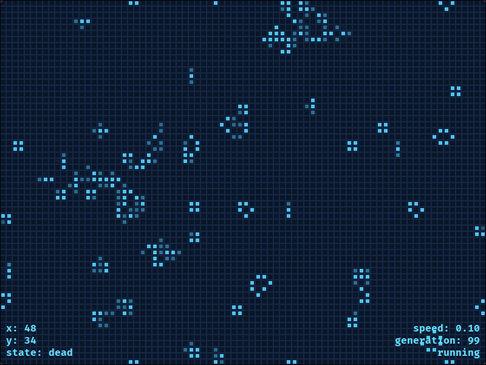

<h1 align="center">Game of Life</h1>
<p align="center">A Conway's Game of Life implementation in C++20 with SDL3, featuring smooth animations, a camera system, and a polished ocean-themed UI.</p>
<p align="center">  </p>

## Features

- **Conway's Rules** — classic Game of Life simulation on a toroidal (wrap-around) grid
- **Smooth Fade** — cells fade in when born and fade out when dying, updated every frame independent of simulation speed
- **Camera** — pan with right-click drag, zoom with scroll wheel, centered on the screen
- **Interactive** — left-click to toggle cells, pause/resume, randomize, and adjust simulation speed
- **HUD** — displays simulation state, speed, cursor position, and cell state under the cursor
- **Ocean Theme** — dark blue background, cyan cells, subtle grid lines

## Controls

| Input | Action |
|---|---|
| `Space` | Pause / Resume |
| `R` | Randomize grid |
| `Escape` | Quit |
| `Scroll Up/Down` | Zoom in / out |
| `Right Click + Drag` | Pan camera |
| `Left Click` | Toggle cell alive/dead |

## Building

**Dependencies:**
- CMake 3.20+
- SDL3
- SDL3_ttf

```bash
git clone https://github.com/JJ0o0/GameOfLife
cd GameOfLife
cmake -B build
cmake --build build
./build/app
```

## Project Structure

```
GameOfLife/
├── assets/
│   └── fonts/
├── include/GameOfLife/core/
│   ├── App.hpp        # Main application loop
│   ├── Camera.hpp     # Camera struct (x, y, zoom)
│   ├── Grid.hpp       # Simulation grid
│   ├── HUD.hpp        # Text rendering utilities
│   └── Utils.hpp      # String formatting, fillCircle
└── src/
    ├── core/
    │   ├── App.cpp
    │   ├── Grid.cpp
    │   ├── HUD.cpp
    │   └── Utils.cpp
    └── main.cpp
```

## Architecture

The simulation separates concerns across three main classes. `Grid` owns the cellular automaton — two `std::vector<bool>` buffers (current and next generation) plus a `std::vector<float>` for per-cell alpha, updated every frame for smooth fading. `App` drives the game loop, owns the `Camera`, and delegates rendering and event handling. `HUD` and `Utils` are stateless namespaces with free functions for text rendering and drawing primitives.

## License

[MIT](LICENSE)